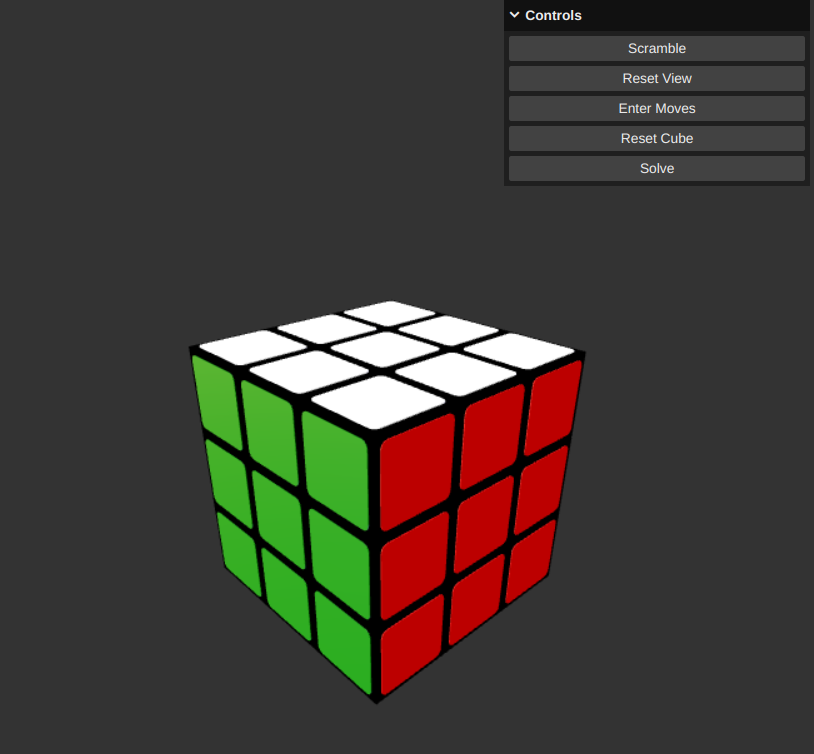

# Rubik's Cube

A Rubik's Cube simulator written using ThreeJS and vanilla JavaScript.

## Controls

* Left click and drag to rotate the cube
* Scroll to zoom in and out
* Left click on a face to rotate it clockwise
* Right click on a face to rotate it anticlockwise

## Features

* Move input in Singmaster notation
* Solving algorithm using Fridrich method (CFOP)

## Credits

* Solver algorithm from https://www.jsdelivr.com/package/npm/rubiks-cube-solver

## Future Plans

- [ ] Implement solver algorithm myself

## Author

Soham Korade
